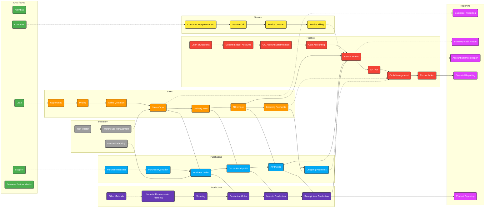

# DiagramaProcesos

```mermaid
graph LR
    %% CRM / SRM
    subgraph CRM [CRM / SRM]
        ACT(Activities)
        CUST(Customer)
        LEAD(Lead)
        SUPP(Supplier)
        BPM(Business Partner Master)
    end

    %% Service
    subgraph Service [Service]
        CEC(Customer Equipment Card)
        SC(Service Call)
        SCON(Service Contract)
        SB(Service Billing)
    end

    %% Sales
    subgraph Sales [Sales]
        OPP(Opportunity)
        PRIC(Pricing)
        SQ(Sales Quotation)
        SO(Sales Order)
        DN(Delivery Note)
        ARI(AR Invoice)
        INP(Incoming Payments)
    end

    %% Purchasing
    subgraph Purchasing [Purchasing]
        PR(Purchase Request)
        PQ(Purchase Quotation)
        PO(Purchase Order)
        GRPO(Goods Receipt PO)
        API(AP Invoice)
        OUTP(Outgoing Payments)
    end

    %% Production
    subgraph Production [Production]
        BOM(Bill of Materials)
        MRP(Material Requirements Planning)
        SRC(Sourcing)
        PRO(Production Order)
        ITP(Issue to Production)
        RFP(Receipt from Production)
    end

    %% Inventory
    subgraph Inventory [Inventory]
        IM(Item Master)
        WM(Warehouse Management)
        DP(Demand Planning)
    end

    %% Finance
    subgraph Finance [Finance]
        COA(Chart of Accounts)
        GLA(General Ledger Accounts)
        GLAD(G/L Account Determination)
        CA(Cost Accounting)
        JE(Journal Entries)
        APAR(AP / AR)
        CM(Cash Management)
        REC(Reconciliation)
    end

    %% Reporting
    subgraph Reporting [Reporting]
        BR(Backorder Reporting)
        IAR(Inventory Audit Report)
        ABR(Account Balances Report)
        FR(Financial Reporting)
        PRR(Product Reporting)
    end

    %% Flujos y Conexiones Principales (De Izquierda a Derecha)
    
    CUST -.-> CEC
    LEAD -.-> OPP
    SUPP -.-> PR

    %% Service
    CEC --> SC --> SCON --> SB

    %% Sales
    OPP --> PRIC --> SQ --> SO --> DN --> ARI --> INP

    %% Purchasing
    PR --> PQ --> PO --> GRPO --> API --> OUTP

    %% Production
    BOM -.-> MRP
    MRP --> SRC --> PRO --> ITP --> RFP

    %% Inventory
    IM --> WM --> SO
    DP --> PO
    
    %% Sincronización vertical de documentos
    SO --- PO
    PO --- PRO
    DN --- GRPO
    GRPO --- ITP
    ARI --- API
    API --- RFP
    INP --- OUTP
    
    %% Finance 
    COA --> GLA --> GLAD --> CA --> JE
    JE --> APAR --> CM --> REC
    
    %% Integración con Finanzas (Financial Postings)
    SB -.-> JE
    ARI --> JE
    API --> JE
    RFP --> JE
    INP -.-> CM
    OUTP -.-> CM

    %% Integración con Reportes
    SO -.-> BR
    JE -.-> IAR
    JE -.-> ABR
    REC --> FR
    RFP --> PRR
    
    %% Estilos (Colores aproximados a la imagen)
    classDef crm fill:#4CAF50,stroke:#333,stroke-width:2px,color:white;
    classDef srv fill:#FFEB3B,stroke:#333,stroke-width:2px,color:black;
    classDef sls fill:#FF9800,stroke:#333,stroke-width:2px,color:white;
    classDef pur fill:#03A9F4,stroke:#333,stroke-width:2px,color:white;
    classDef pro fill:#673AB7,stroke:#333,stroke-width:2px,color:white;
    classDef inv fill:#9E9E9E,stroke:#333,stroke-width:2px,color:white;
    classDef fin fill:#F44336,stroke:#333,stroke-width:2px,color:white;
    classDef rep fill:#E040FB,stroke:#333,stroke-width:2px,color:white;

    class ACT,CUST,LEAD,SUPP,BPM crm;
    class CEC,SC,SCON,SB srv;
    class OPP,PRIC,SQ,SO,DN,ARI,INP sls;
    class PR,PQ,PO,GRPO,API,OUTP pur;
    class BOM,MRP,SRC,PRO,ITP,RFP pro;
    class IM,WM,DP inv;
    class COA,GLA,GLAD,CA,JE,APAR,CM,REC fin;
    class BR,IAR,ABR,FR,PRR rep;

```
